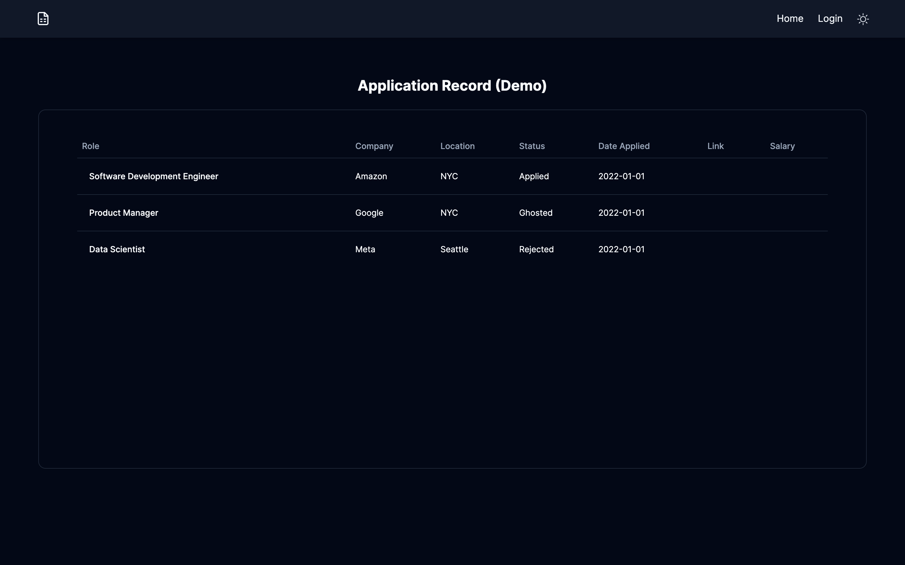

<h1 align="center">Application Record 📄</h1>

<h3 align="center">🐰 Next.js, TailwindCSS, ShadcnUI, Supabase 🐰</h3>

<p align="center">
  
</p>


<p>Tired of using SpreadSheets to keep track of your applications, this web app helps to simplify your needs and is minimalistic to the eye</p>

#
## 🛠️ Set Up
I. Install Dependencies
```bash
$ bun install 
or
$ npm install
or 
$ yarn install
or 
$ pnpm install
```

II. Start Development Server
```bash
$ bun run dev / bun --bun run dev
or 
$ npm run dev
or
$ yarn run dev
or
$ pnpm dev
```

## 💻 Build and Run to production
```
$ bun run build
or
$ npm run build
or
$ yarn run build
or
$ pnpm build
```